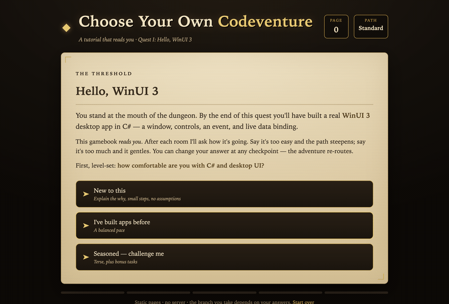
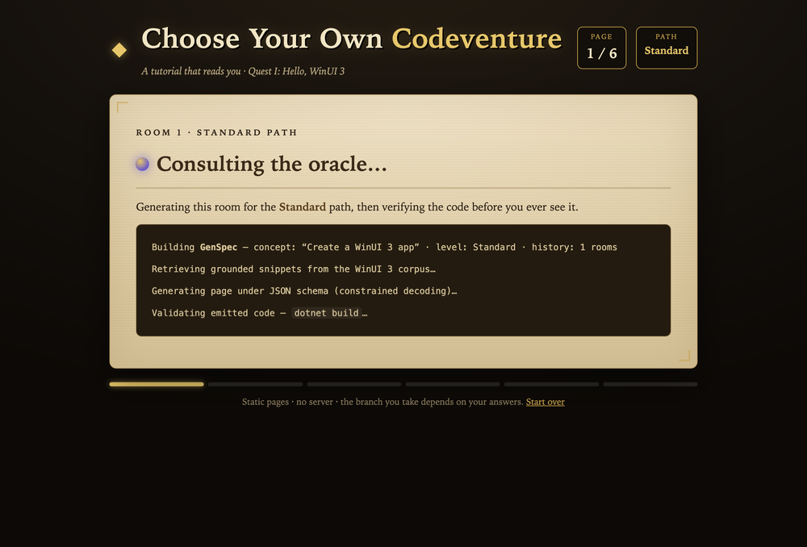
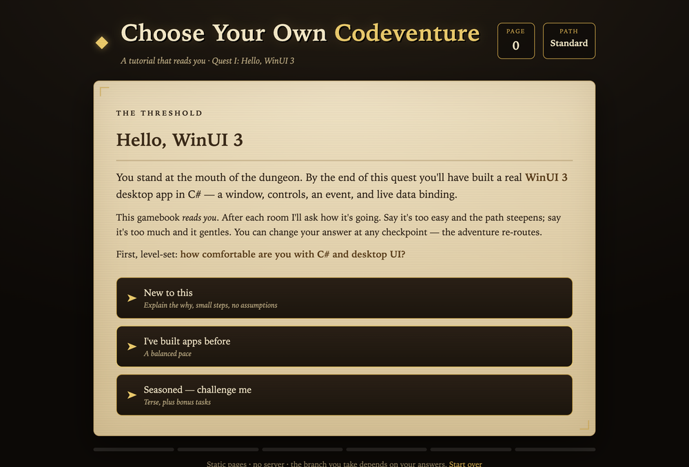
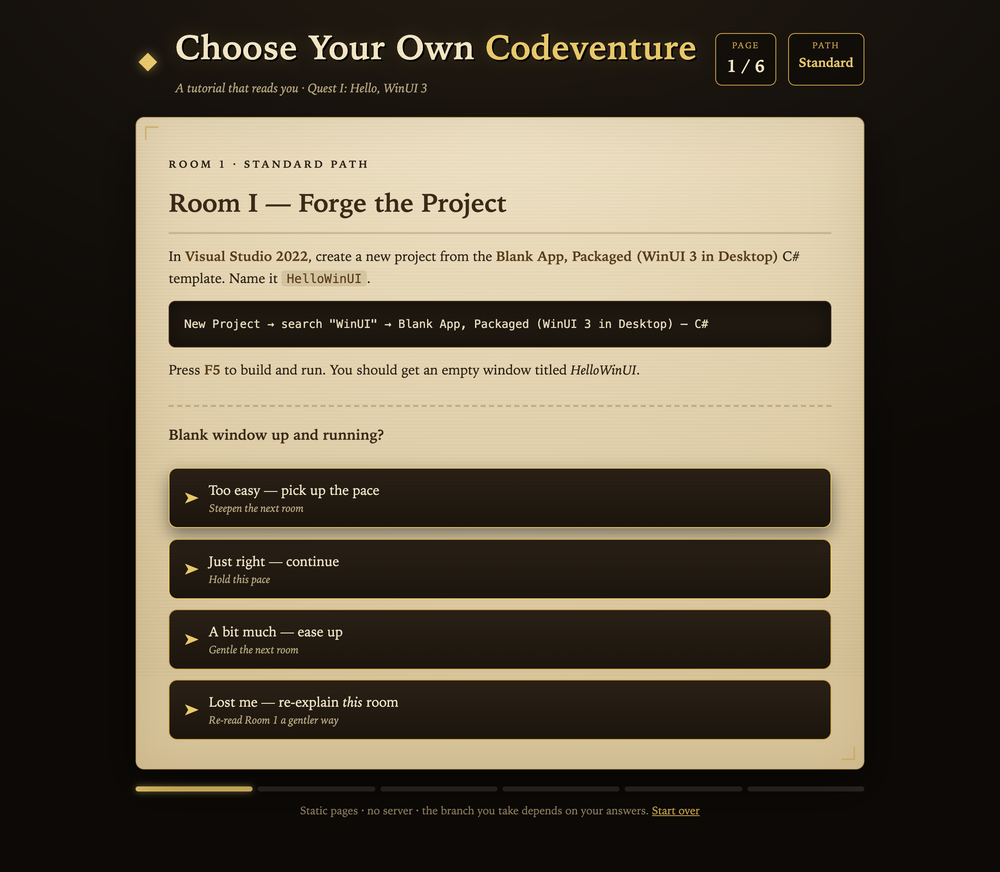
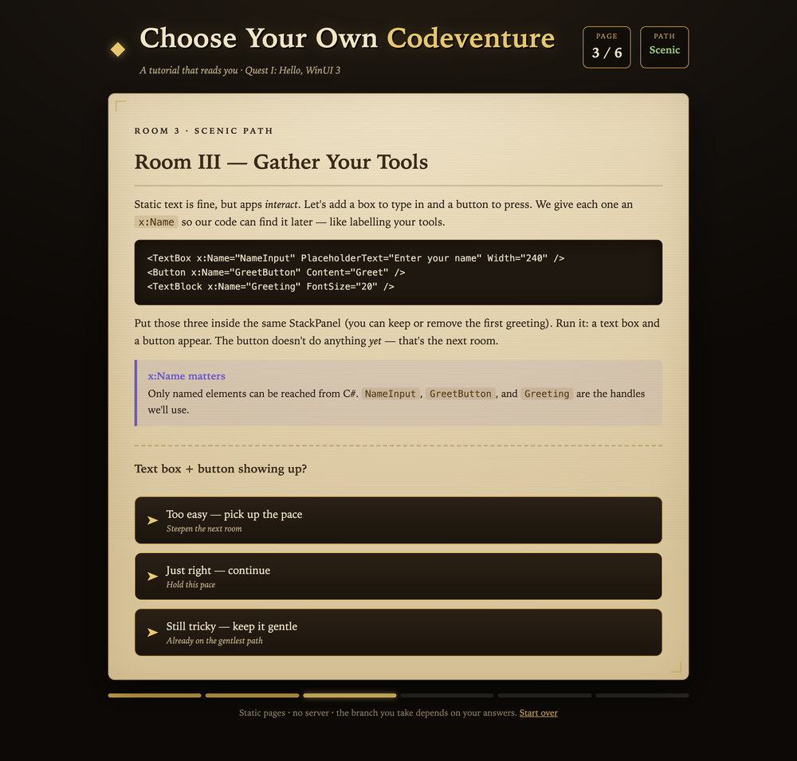
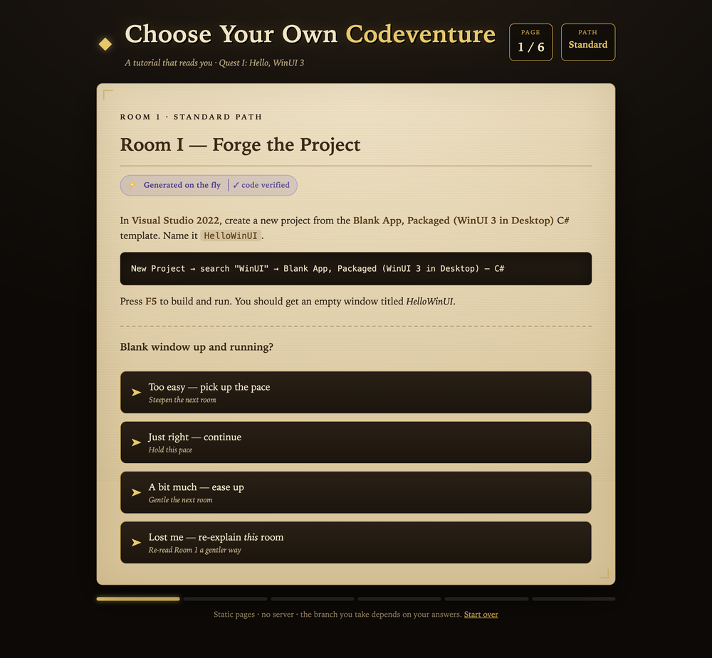

# Choose Your Own Codeventure — a tutorial that reads you

A **static, no-build** proof-of-concept for adaptive tutorials. It teaches the
WinUI 3 "hello app" as a 1980s-style **choose-your-own-adventure gamebook** —
but instead of turning to a page number, the book turns *itself* based on how
you're doing.

**[▶ Live demo](https://grantmestrength.github.io/Tutorial/)** (GitHub Pages)



Two readers finish the same quest having read different books — the check-in
after each room quietly steepens, gentles, or re-explains the next page.

## The idea

Static tutorials are one-size-fits-none: beginners get lost, experts get bored.
This demo shows a third way — **composition over generation**:

- Content is a library of **pre-authored, pre-verified pages** (`content.js`),
  each written at three depths: *Scenic* (gentle), *Standard*, *Expert*.
- A tiny **engine** (`engine.js`) never writes code. It only **selects and
  sequences** pages based on one adaptive value: the reader's current path.
- After every "room," a **check-in** re-routes:
  - *Too easy* → the next room steepens.
  - *A bit much* → the next room gentles.
  - *Lost me* → **re-read the same room, one level simpler**, then continue.
- The ending shows the **exact path the reader took** — two readers finish the
  same quest having read different books.

Nothing runs on a server. The "adaptivity" is real branching over a fixed,
trustworthy content set — which is exactly what makes it safe to ship as a
static site (and, later, to publish as guaranteed-correct tutorials).

## How it maps to the hackathon pitch

| Pitch concept | In this demo |
|---|---|
| Level-setting interview | The opening three-door page |
| Adapts as you go | Check-ins that raise/lower depth per room |
| No risky code execution | Pages are pre-verified; engine only selects |
| "Reads you" | Path recap at the end |
| Future: dynamic/hosted | The **PageProvider seam** — swap the selector for an LLM (`?ai=1`) |

## Two tiers, one engine

The engine never asks *"what's the HTML for this room?"* — it asks a
**provider**:

```js
provider.getRoom(spec) → Promise<Page>
```

Same call, two implementations. Swapping them is the whole difference between a
static tutorial and an AI-generated one — the engine doesn't change.

- **Static tier** (default) — `StaticPageProvider` returns a pre-authored,
  verified page instantly. This is what ships today.
- **Dynamic tier** (`?ai=1`) — `MockLLMPageProvider` runs the *real shape* of a
  generation pipeline and streams each step to an on-screen **oracle** console:
  build a GenSpec → retrieve grounded snippets → generate under a JSON schema →
  **validate the emitted code (`dotnet build`)** → repair-or-fall-back. Only the
  model call is stubbed (it re-uses the verified body), so the demo code stays
  correct while the *seam* is real. Add `&fail=1` to force the build-failure →
  repair loop.

Rendered pages carry a small **provenance pill** so you can see where each page
came from — *library*, *generated on the fly*, or *fallback*.



## Screenshots

| | |
|---|---|
|  |  |
|  |  |

## Files

| File | Role |
|---|---|
| `index.html` | Shell: masthead, parchment stage, footer |
| `styles.css` | Dungeon-gamebook theme (+ oracle console & provenance pill) |
| `content.js` | The content library (stages × depth variants) — **edit this to add rooms** |
| `provider.js` | The **PageProvider seam**: static library today, LLM tomorrow |
| `engine.js` | The "dungeon master": state, selection, check-ins, recap |

## Run locally

No dependencies. Serve the folder:

```bash
python3 -m http.server 8777
# open http://127.0.0.1:8777/            → static tier
# open http://127.0.0.1:8777/?ai=1       → dynamic tier (the oracle)
# open http://127.0.0.1:8777/?ai=1&fail=1 → force the build-fail → repair loop
```

## Add a room

Append a stage to `QUEST.stages` in `content.js` with `gentle` / `standard` /
`challenge` variants and a `checkpoint`. The engine picks it up — no code
changes.

## Publish (GitHub Pages)

Settings → Pages → Source: **Deploy from a branch** → `main` / root. The site
goes live at `https://<user>.github.io/Tutorial/`.

---

*Hackathon note:* "Choose Your Own Adventure" is a Chooseco trademark — safe as
internal framing; the shipping name is **Codeventure**.
